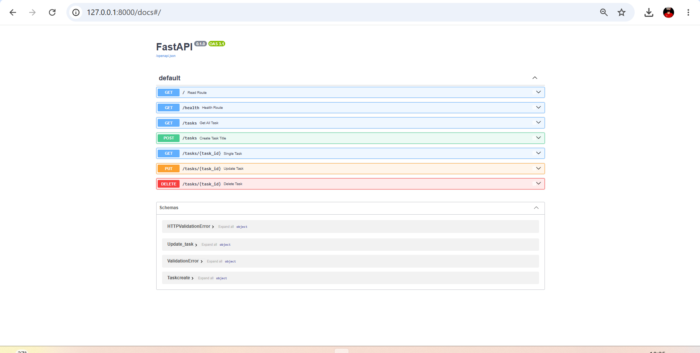
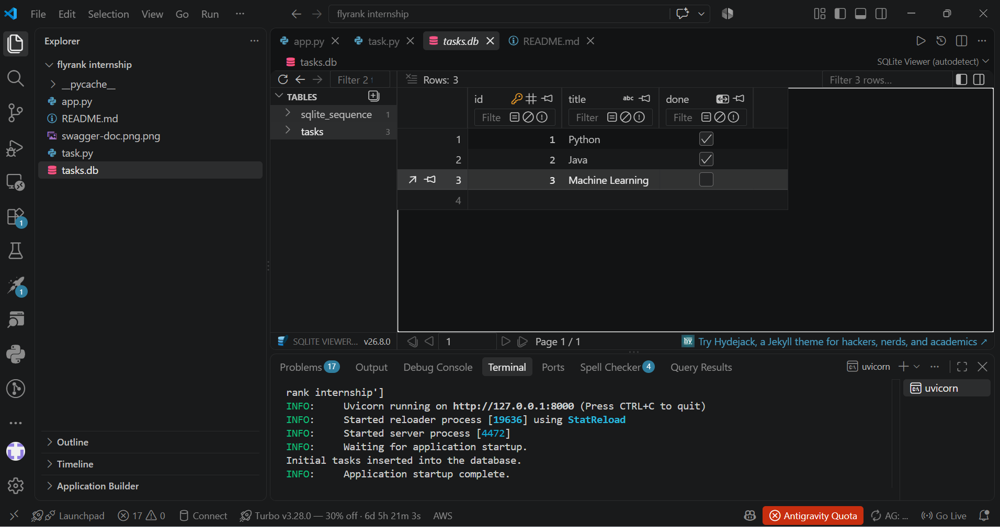

# FastAPI Task Management API 🚀

A lightweight, robust RESTful CRUD API built using Python and FastAPI for managing a to-do list. Updated as part of the FlyRank Internship (Backend Track - Week 3 Assignment A1) to support persistent storage via SQLite.

---

## 📌 Features

* **Complete CRUD Operations**: Support for creating, reading, updating, and deleting tasks.
* **Persistent Storage (SQLite)**: Tasks are stored in a persistent SQLite database (`tasks.db`), ensuring data survives server restarts.
* **Auto DB Initialization**: Automatically creates the `tasks` table and populates initial sample tasks on the first run.
* **Input Validation**: Pydantic models for payload validation (rejecting empty or whitespace-only titles with HTTP 400).
* **Standard HTTP Status Codes**: Explicit usage of `200 OK`, `201 Created`, `204 No Content`, `400 Bad Request`, and `404 Not Found`.
* **Interactive Documentation**: Built-in Swagger UI provided automatically by FastAPI.

---

## 💾 Database Architecture

* **Database Engine**: SQLite (chosen for its zero-configuration, lightweight, and file-based persistence nature).
* **Database File**: Stored locally at the root directory as `tasks.db`.
## 📸 Swagger UI Verification

Verified endpoint testing interface via Swagger UI:

## 📸 Swagger UI Verification

Verified endpoint testing interface via Swagger UI:
